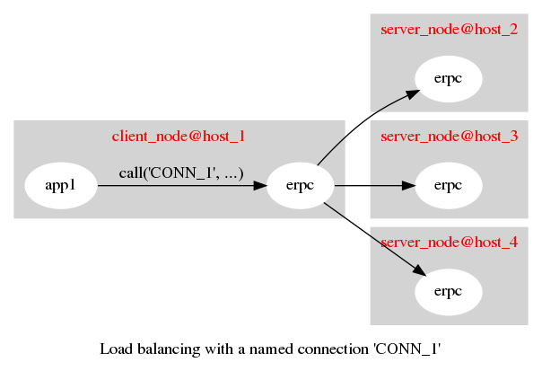
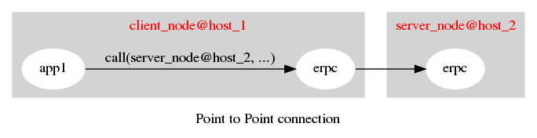

# erpc

This application is an alternative to the native Erlang RPC mechanism.

## Contents
- [Introduction](#introduction)
- [Build and Test](#build-and-test)
- [Configuration](#configuration)
- [Dependencies](#dependencies)
- [TODO](#todo)
- [Example usage](#example-usage)
- [API](#api)
  - [Types](#types)
- [Load test results](#load-test-results)
- [License](#license)

## Introduction

This application is intended to be a replacement for native RPC. It
tries to mimic the native rpc API as far as possible. It allows
unidirectional connections between nodes. Where bi-directional
connections are required, they need to be configured explicitly. There
is host level and node level ACLs configurable. It is possible to
setup application specific connections between nodes. It supports
multiple TCP/TLS connections per host and load balancing of traffic across
nodes.

From a client perspective, there is no message passing involved to
make an erpc call - only one ETS lookup. To receive the response there
are two messages passed. One from the socket to the socket handling
process, and one message from the socket handling process to the
calling process.

On the server side, a separate process is spawned for each request received.

The following figure shows a load-balanced connection.



The following figure shows a "traditional" point-to-point unidirectional erpc connection.


## Build and Test

### Compile
```
make
```

### Run tests
Common test suite
```
make test
```

Native RPC load test
```
make rpc_load_test
```

ERPC load test
```
make erpc_load_test
```

### Dialyzer checks

```
make dialyze
```

## Configuration

Example configuration is shown below. Copy the `erpc` section into your `sys.config` and edit as appropriate.

```erlang
[{erpc, [
         %%
         %% Change to 'allow' if you want to  enable any node
         %% to connect into this node. Node level ACLs take precedence over
         %% host level ACLs
         %%
         {default_node_acl, deny},

         %%
         %% Change to 'allow' if you want nodes on any host
         %% to connect into this node
         %%
         {default_host_acl, deny}, 

         %% {Module, Function} to output trace messages from the erpc
         %% application. Remove this config item if you don't want any
         %% trace messages from this application. If a different
         %% {Module, Function} is configured it should be accept
         %% arguments in the same format as io:format/2
         {logger_mf, {io, format}},

         %%
         {client_config, [
                          {a@localhost, [
                                         {hosts, [{"127.0.0.1", 9090}]},
                                         {num_connections, 1} %% Optional config item. Defaults to 1
                                        ]
                          },
                          %%
                          %% This is an example of a load balanced endpoint. Calls such as
                          %% erpc:call('DB', Mod, Fun, Args) will be load balanced evenly across
                          %% all the connected hosts
                          %%
                          {'DB', [
                                        {hosts, [{"10.1.1.1", 9090},
                                                 {"10.2.2.2", 9090},
                                                 "10.3.3.3"  %% In this case, erpc assumes a port value of 9090
                                                ]
                                        }
                                 ]
                          },
                          {c@localhost, [
                                         {hosts, [{"127.0.0.1", 9092}]}
                                        ]
                          }
			 ]
         },
         {server_config, [
                          %% Default listen port is 9090
			  {listen_port, 9090},

                          %% Default transport is tcp. Supported values are 'tcp' or 'ssl'
                          {transport, tcp},

                          %% ACLs specified here take precedence over
                          %% the 'default_host_acl' setting
                          {host_acls, [
                                       {{127,0,0,1}, all}
                                      ]
                          },

			  {node_acls, [
                                       %% Processes running on
                                       %% b@localhost are allowed to
                                       %% invoke any combination of
                                       %% {M, F} on this node
                                       {b@localhost, all},

                                       %% Processes running on the
                                       %% node 'c@localhost' are only
                                       %% allowed to invoke the
                                       %% specified combination of
                                       %% {Module, Function} pairs
                                       {c@localhost, [{module_1, func_1}, 
                                                      {module_1, func_2}]}
                                      ]
			  }
                         ]
         }
        ]
 }].
```

## Dependencies

None. Yay!

## TODO

1. Automeshing of nodes as an option
1. Bi-directional connections as an option
1. **DONE** - Monitoring of node connections (similar to erlang:monitor_node/2)
1. SCTP support
1. **DONE** - Support for async_call and nb_yield similar to native RPC

## Example usage

```erlang
1> application:ensure_all_started(erpc).
...
{ok,[sasl,erpc]}

2> erpc:connect('TEST_1', [{hosts, [{"localhost", 9091}, {"localhost", 9092}]}]).
...
ok

3> erpc:conn_status().
[{'TEST_1',true}]

4> erpc:incoming_conns().
[]

5> erpc:outgoing_conns().
[erpc_test_1@localhost]

6> erpc:call('TEST_1', calendar, local_time, []).
{{2016,5,17},{15,30,31}}

%% You can connect to the same node with a different connection name
7> erpc:connect('TEST_2', [{hosts, [{"localhost", 9091}, {"localhost", 9092}]}]).
ok

8> erpc:conn_status().                                                           
[{'TEST_2',true},{'TEST_1',true}]

%% It will report a unique list of erlang nodes it is connected to
9> erpc:outgoing_conns().                                                        
[erpc_test_1@localhost]

10> erpc:call('TEST_2', calendar, local_time, []).                                
{{2016,5,17},{15,32,27}}

11> erpc:multicall(['TEST_1', 'TEST_2'], calendar, local_time, []).
{
  %% Successful responses
  [{{2016,5,17},{15,32,52}},
   {{2016,5,17},{15,32,52}}],

  %% List of failed connections
  []
}

%% Setup a connection to a non-existent end point
12> erpc:connect('TEST_3', [{hosts, [{"localhost", 12345}]}]).                    
ok

%% conn_status() reports that connection to 'TEST_3' is down
13> erpc:conn_status().                                            
[{'TEST_3',false},{'TEST_2',true},{'TEST_1',true}]

14> erpc:multicall(['TEST_1', 'TEST_2', 'TEST_3'], calendar, local_time, []).
{
  %% Successful responses
  [{{2016,5,17},{15,34,17}},
   {{2016,5,17},{15,34,17}}],

  %% List of failed connections
  ['TEST_3']
}

15> erpc:cast('TEST_1', calendar, local_time, []).
ok

16> erpc:multicast(['TEST_1', 'TEST_3'], calendar, local_time, []).
ok

17> erpc:is_connection_up('TEST_1').
true

18> erpc:is_connection_up('TEST_3').
false

%% Here, erpc figures out the host as localhost and assumes the default port value of 9090
19> erpc:connect(erpc_test_1@localhost).
ok

20> erpc:conn_status().
[{erpc_test_1@localhost,true},
 {'TEST_3',false},
 {'TEST_2',true},
 {'TEST_1',true}]

21> erpc:disconnect(erpc_test_1@localhost).   
ok

22> erpc:conn_status().                    
[{'TEST_3',false},{'TEST_2',true},{'TEST_1',true}]

```

## API

### Types

```erlang
-type conn_name()       :: atom().
-type node_name()       :: atom(). %% An Erlang style node name
-type num_connections() :: integer().

-type port_number()     :: pos_integer().
-type hostname()        :: string().
-type host_spec()       :: {hostname(), port_number()}
-type conn_option()     :: {hosts, [host_spec()]} | {num_connections, pos_integer()}.
-type conn_status()     :: boolean().
```
### call/4

Same as ``` call(Name, Module, Function, Args, 5000)```.

### call/5

```erlang
call(Name :: conn_name(), Module::atom(), Function::atom(), Args::list(), Timeout::pos_integer()) -> {badrpc, term()} | term().
```

### cast/4

```erlang
cast(Name :: conn_name(), Module::atom(), Function::atom(), Args::list()) -> ok | {badrpc, not_connected}.
```

Fire and forget.

### multicast/4

```erlang
multicast(Conns :: [conn_name()], Module::atom(), Function::atom(), Args::list()) -> true.
```

Fire and forget.

### multicall/4

Same as multicall/5 invoked with a timeout of 5000 milliseconds.

### multicall/5

```erlang
multicall(Names :: [conn_name()], Module::atom(), Function::atom(), Args::list(), Timeout::pos_integer()) -> {ResL :: [term()], BadNodes :: [conn_name()]}.
```

Mimics the behaviour of ```rpc:multicall/5```.

### conn_status/0

```erlang
conn_status() -> [{conn_name(), conn_status()}].
```

### incoming_conns/0

```erlang
incoming_conns() -> [node_name()].
```

The list of inbound connections from peer erlang nodes. The actual node names of the connected nodes are returned here.

### outgoing_conns/0

```erlang
outgoing_conns() -> [node_name()].
```

The list of outbound connections to peer erlang nodes. The actual node names of the connected nodes are returned here.

### connect/1
```erlang
connect(Node_name :: node_name()) -> ok.
```

Establish an `erpc` connection to the specified node using the following default settings. The host part (from `node@host`) is extracted from the node name, and a single TCP connection will be setup on port 9090 which is the default listen port. This API is useful for applications to setup connections on demand. Note that the `erpc` application will ignore the part of the name before the `@` so different applications can setup different connections to the same node for application specific traffic.

A separate set of processes is spawned under the `erpc_sup` supervisor so this connection will persist until the node is restarted or the `disconnect/1` API is called.

### connect/2
```
connect(Conn_name :: conn_name(), Conn_options :: [conn_option()]) -> ok.
```

### disconnect/1
```erlang
disconnect(Name :: conn_name()) -> ok.
```

### is_connection_up/1
```
is_connection_up(Conn_name :: conn_name()) -> boolean().
```

Returns the status of the named connection.

### monitor_node/1
```
monitor_node(Node_name :: node_name()) -> ok.
```

Monitors a remote erlang node using an erpc connection. When the erpc connection to the node is disconnected, the calling process will receive a message of the form:
```erlang
{erpc_node_down, node@host}
```

When the erpc connection is re-established, the calling process will receive a message of the form:
```erlang
{erpc_node_up, node@host}
```

The monitor stays active until the calling process explicitly invokes ```erpc:demonitor_node/1```.

### demonitor_node/1
```
demonitor_node(Node_name :: node_name()) -> ok.
```

Removes a monitor setup using the ```monitor_node/1``` function.

### monitor_connection/1
```
monitor_connection(Name :: conn_name()) -> ok.
```

Monitors a named erpc connection. When connections to all hosts which are part of this connection are down, the calling process will receive a message of the form (where 'TEST' is the name of the connection):
```erlang
{erpc_conn_down, 'TEST'}
```

When a connection is re-established to at least one of the hosts, the calling process will receive a message of the form (where 'TEST' is the name of the connection):
```erlang
{erpc_conn_up, 'TEST'}
```

The monitor stays active until the calling process explicitly invokes ```erpc:demonitor_connection/1```.

### demonitor_connection/1
```
demonitor_connection(Name :: conn_name()) -> ok.
```

Removes a monitor setup using the ```monitor_connection/1``` function.

## Load test results

### Native RPC

```
$ make rpc_load_test
Starting test node 1...
Starting test node 2...
...
2016-05-17_15:51:14 -- Starting spawn of 20000 workers...
2016-05-17_15:51:15 -- Finished spawning workers
2016-05-17_15:51:15 -- Waiting for 20000 workers to finish...
...

Start time                   : 2016-05-17_15:51:14
End time                     : 2016-05-17_15:52:14
Elapsed time (seconds)       : 60
Number of attempted requests : 2000000
Req/sec                      : 33333

...
```

### ERPC

```
$ make erpc_load_test
Starting test node 1...
Starting test node 2...
...
2016-05-17_15:53:27 -- Starting spawn of 20000 workers...
2016-05-17_15:53:27 -- Finished spawning workers
2016-05-17_15:53:27 -- Waiting for 20000 workers to finish...
...

Start time                   : 2016-05-17_15:53:27
End time                     : 2016-05-17_15:53:49
Elapsed time (seconds)       : 22
Number of attempted requests : 2000000
Req/sec                      : 90909

...
```

## License

Apache 2.0
